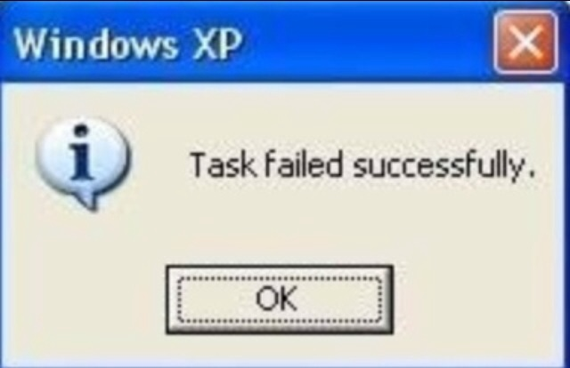

*Written on 2021-08-01 by Marek Jędryka*

# Part 2: Running tests

In the [first part](nyan-cat-ogg-01.md) of this series, I presented playing audio using streams.
Today I'm going to show you how to add a picture to the audio and combine all of this with running tests.


## The picture

If we have OGG file playing the "nyan cat" theme then it's obvious thing to add an animation of the rainbow kitty.
I guess you didn't expect anything else.

For the rainbow cat animation in tests, `tap-nyan` package works great.
I can get it from NPM registry, but it has an issue in showing a valid amount of skipped test cases.
So I recommend you download a fork project from Github repository: `github:LKay/tap-nyan`
This fork is including small fixes of skipped test cases count presentation.

To see `tap-nyan` in action, we need to run a lot of test cases and produce in that way TAP report.
TAP (Test Anything Protocol) is a simple text interface used to store and process test result reports.
So `tap-nyan` is a TAP consumer in our case, also known as a TAP reporter.
We still need a TAP producer to feed us rainbow kitty.
Let's use `ava` NPM package for this purpose.
It's a small JavaScript testing library that can produce output in TAP format using `--tap` CLI switch.

```JS
import test from 'ava'


const pass = t => t.pass()
for (let i=0; i<200; i++) {
  test(`test No ${i}`, pass)
}
```

In above code, you can see 200 test cases pass immediately and unconditionally.
It's sufficient in our scenario because we need to just produce test report.
You can run the code by calling command in your shell:

```sh
yarn ava test.js --tap | yarn tap-nyan
```

The command produces output as on below video:

##### TAP nyan runs 200 test cases
<!--  -->
<video controls src="./video/nyan-cat-1.webm" width="768">
  Your browser does not support the video tag or WEBM files.
</video>

References:

- https://www.npmjs.com/package/tap-nyan
- https://github.com/LKay/tap-nyan/commit/f27ca5cd8b330dd9b69569ea57389a6aa6292c4e
- https://github.com/LKay/tap-nyan
- https://testanything.org
- https://www.npmjs.com/package/ava


## To add sound to the picture

We have the picture now thanks `ava` and `tap-nyan` packages.
We need to play sound at the same time as our picture from nyan TAP reporter is playing.
That means we have to run two tasks concurrently.
What's more, we have to stop playing the sound when the cat stops running, to us tests would be done.

This challenge can be perfectly fulfilled by `concurrently` package from NPM registry.
Just see this command:

```sh
yarn concurrently -k --raw \
  "yarn ava test/massive.test.js --tap --timeout=2m | yarn tap-nyan" \
  "node --experimental-specifier-resolution=node src/ogg.js &> /dev/null"
```

It will play nyan cat theme and show `tap-nyan` output to the console at the same time.
It's possible because `concurrently`'s CLI switches:

* `-k` (or `--kill-others`) will kill other processes when the first one would exit, in our case when test would finish (doesn't matter if pass or fail)
* `--raw` (or short `-r`) will output raw output from processes, `concurrently` overhead is excluded

### Command improvements

The above way of running `concurrently` have two small issues:

#### 1. Wrong concurrently exit code

When the tests end (and pass) we can see the following error message:

> error Command failed with exit code 1.

BTW I know a perfect picture to describe this situation:



It's caused by a non-solved issue in `yarn`.
Maybe it will be fixed someday.
The fastest workaround for that is `yarn` replacement by `npx`.
It's running without error now.

#### 2. It's not easy to read

We can improve readability easily and quickly.
Just add these `scripts` section to your `package.json`

```text
"scripts": {
    "ogg": "node --experimental-specifier-resolution=node src/ogg.js",
    "start": "npx concurrently -k --raw \"yarn test\" \"yarn ogg &> /dev/null\" || exit 0",
    "test": "yarn ava test/massive.test.js --tap --timeout=2m | yarn tap-nyan"
  }
```

`start` is the main script that calls the other two `test` and `ogg`

References:

- https://www.npmjs.com/package/concurrently
- https://github.com/yarnpkg/yarn/issues/4667
- https://knowyourmeme.com/photos/918810-funny-error-messages


## Result

You can call simply `yarn start` now.
It plays sound as long as tests are running.

See you in the next part!

##### TAP nyan runs 200 test cases and plays sound
<!--  -->
<video controls src="./video/nyan-cat-2.webm" width="768">
  Your browser does not support the video tag or WEBM files.
</video>
