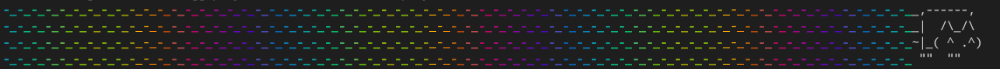

*Written on 2021-12-31 by Marek Jędryka*

# Part 3: Nyan cat OGG script implementation

As I specified in previous post, I need a CLI tool for running tests and playing sound at the same time.
The tool should be configurable at runtime, so I need to support a few arguments given during the process start.

##### TAP nyan reporter with sound
<!--  -->
<video controls src="./video/nyan-cat-4.webm" width="768">
  Your browser does not support the video tag or WEBM files.
</video>

Above is working example video.
Details are placed below.

## CLI arguments

The first thing that the user interacts with text-mode application is the CLI.
It should offer nice, easy to read help message.
To implement that layer of the program let's use `yargs` library from NPM public repository.
It's powerful tool for parsing `argv` array of node's process.

### External TAP consumer

I want to let the user the possibility of passing an external TAP consumer binary.
However, after thinking about that for a while, I realized producing raw TAP output would be the better option.
Based on this reflection, I introduced `--tap` boolean argument.
It's optional parameter with false as the default value.
Their alias is `-t` shortening.

### Audio file

This is the highlight section.
Let me introduce `--audio` (with `-a` alias) parameter here.
It's optional argument with nyan cat song as the default value.
If you wish for another sound, you can pass relative or global path to OGG file.

### Silence

If you wish to use the application in silent mode, you can use `--silence` (or `-s` alias) boolean argument.
It's optional parameter with false as the default value.

### Test commands

Last but not least, I introduced a required parameter to pass test commands producing TAP stream.
The parameter takes 1 string by occurrence.
It can be used more than once.
They are named `--producer` with `-p` shortening.


## Implementation details

I had a few problems during the implementation.

### Concurrency

The first one was the inability to play audio and produce output on `stdout` at the same time.
This was manifested by the sound stamming while printing text output, as you can see below.

##### Sound stamming at single threaded application
<!--  -->
<video controls src="./video/nyan-cat-3.webm" width="768">
  Your browser does not support the video tag or WEBM files.
</video>

This is due to node.js working on single thread.
So I needed to move the audio playback to separated thread.

The first attempt failed.
I tried to use `worker_threads` from node API but I got an error message about unable to use unregistered module for decoding OGG files.
I don't remember exactly.
Anyway, I didn't understand the reason and I couldn't solve it, so I made another attempt.

This time I used the `child_process` API.
All I had to do was terminate the child process at right time by using `AbortController`.

```JS
import { fork } from 'child_process'

import { wait } from './wait'


const controller = new AbortController()
const audio = fork('./src/audio.js', [argv.audio], {
  signal: controller.signal,
})
audio.on('error', (err) => {
  if (err.code !== 'ABORT_ERR') console.error(err)
})
await wait(tasks)
controller.abort()
```

This brings us to the next problem.

### Waiting for child process to end

We had to wait for child process end of working.
I implemented this by listening on `finish` event of writable stream as `stdout` if child process is.
In this listeners callback I'm counting down to 0, using `counter` variable in their closure.
I can resolve returned promise as soon as the countdown is over.

```JS
export const wait = tasks => new Promise(resolve => {
  let counter = tasks.length
  const listener = (...args) => {
    if (--counter === 0) {
      resolve(tasks)
    }
  }
  tasks.forEach(t => {
    t.once('finish', listener)
  })

  // fallback checking tasks
  const intervalId = setInterval(function () {
    if (tasks.every(t => t.exitCode !== null)) {
      clearInterval(intervalId)
      resolve(tasks)
    }
  }, 500)
})
```

Unfortunately, the `finish` event is not always emitted.
I don't know exactly why.
In such situations, I have to rescue by periodical execution of backup code.
Let interval be twice a second.
If every task would be exited with any exit code value then finally promise can be resolved as well.

References:

- https://nodejs.org/dist/latest-v16.x/docs/api/child_process.html
- https://nodejs.org/dist/latest-v16.x/docs/api/worker_threads.html
- https://nodejs.org/dist/latest-v16.x/docs/api/stream.html#event-finish
- https://developer.mozilla.org/en-US/docs/Web/API/AbortController

## Package

You can install and try my CLI tool.
It's published on NPM registry: [tap-ogg](https://www.npmjs.com/package/tap-ogg)
