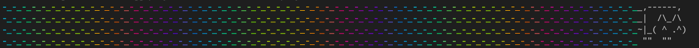

*Written on 2022-10-06 by Marek Jędryka*

# Part 5: Error detection in TAP stream

I have described audio signal processing [recently](nyan-cat-ogg-04.md).
Let's focus on error detection in Test Anything Protocol (TAP) stream today.

I want to detect first test that wouldn't pass.
When the first error will be detected I want to change a boolean flag in the reaction to this event.

## The Stream

Output stream from TAP producer contains text information about test case execution.
The execution data can be one of types (with example outputs):

1. Passing
  ```
  TAP version 13
  (node:7719) ExperimentalWarning: The Node.js specifier resolution flag is experimental. It could change or be removed at any time.
  (Use `node --trace-warnings ...` to show where the warning was created)
  ok 1 - testing 0
  ok 2 - testing 1
  ok 3 - testing 2

  1..3
  # tests 3
  # pass 3
  # fail 0
  ```
2. Skipping
  ```
  TAP version 13
  (node:8144) ExperimentalWarning: The Node.js specifier resolution flag is experimental. It could change or be removed at any time.
  (Use `node --trace-warnings ...` to show where the warning was created)
  ok 1 - massive skipping 0 # SKIP
  ok 2 - massive skipping 1 # SKIP

  1..2
  # tests 2
  # pass 0
  # skip 2
  # fail 0
  ```
3. Failing
  ```
  TAP version 13
  (node:7862) ExperimentalWarning: The Node.js specifier resolution flag is experimental. It could change or be removed at any time.
  (Use `node --trace-warnings ...` to show where the warning was created)
  not ok 1 - failing 0
    ---
      name: AssertionError
      message: Test failed via `t.fail()`
      assertion: fail
      at: 'fail (file://test/massive.test.js:5:21)'
    ...
  not ok 2 - failing 1
    ---
      name: AssertionError
      message: Test failed via `t.fail()`
      assertion: fail
      at: 'fail (file://test/massive.test.js:5:21)'
    ...
  not ok 3 - failing 2
    ---
      name: AssertionError
      message: Test failed via `t.fail()`
      assertion: fail
      at: 'fail (file://test/massive.test.js:5:21)'
    ...

  1..3
  # tests 3
  # pass 0
  # fail 3
  ```

As you can see, each kind of test result has something peculiar.
I will write pseudocode using template string notation from ECMAScript to describe the properties.

For the first type, there is simple one-line message consistent with pattern `ok ${testNumber} - ${testCaseName}`.
Nothing special, to be honest.

For the second kind, there is nearly the same one-liner.
The difference is located at the end of the line.
So our pattern would be written as `ok ${testNumber} - ${testCaseName} # SKIP` in this case.

Last but not least our the most complex output type.
This multi-line message contains a header line and error details in the next lines.
The header line is the most important in our case.
Error details could be neglected at the moment.
So the pattern for the first line would be written as `not ok ${testNumber} - ${testCaseName}`.

## Requirements

Let me consider the requirements that our error message detector should fulfill.

First of all, the detector should be able to observe the TAP stream.
How can I observe a stream?
I can do it by implementing piped pass-through stream, but I can't modify the output stream.
I can just check the input stream and pass them to the output immediately.

In addition, I need to get information if an error has occurred since the program started.
How can I get it?
In one of two ways:

- by adding boolean property able to read
- by emitting an event on the first error message would be detected

Adding read-only boolean property seems much easier to implement, so let's choose this way.

So I can write the requirement as AVA macro:

```JS
import { scheduler } from 'timers/promises'
import { Readable } from 'stream'

import test from 'ava'

import { TapObserver } from '../../src/tap'
import { titleFn } from '../utils'


const isValidMacro = test.macro({
  exec: async (t, source, expected) => {
    const observer = new TapObserver
    source.pipe(observer)

    t.plan(1)
    source.on('end', () => {
      t.is(observer.isValid, expected)
    })
    await scheduler.wait(1)
  },
  title: titleFn('valid state flag for given input', 'from'),
})
```

As you can see, there is a small workaround for `end` event no fire immediately.
Simply waiting for one millisecond is enough for the event would be fired.
It could be caused by the necessity of readable streams ending _ensuring_.
I'm not sure at the moment.
Anyway, it's enough for me now.

For the record, an example of how to use the macro is below:

```JS
for (const [title, ...data] of [
  [
    'empty stream',
    Readable.from([]),
    true,
  ],
  [
    'empty string',
    Readable.from(['']),
    true,
  ],
  // etc.
]) test(title, isValidMacro, ...data)
```

## The Observer

I can follow the above requirement to eventually implement TAP stream observer.
The class source code is given below.

```JS
import { PassThrough } from 'stream'


export class TapObserver extends PassThrough {
  #errorOccured = false
  #errorRegex = /^\s*not ok \d+ - /im
  #buffer = ''

  constructor(options) {
    super(options)
  }

  get isValid() {
    return !this.#errorOccured
  }

  _transform(chunk, encoding, callback) {
    if (this.#errorRegex.test(this._string(chunk))) this.#errorOccured = true
    super._transform(chunk, encoding, callback)
  }

  _string(chunk) {
    const str = chunk.toString()
    const lastBreakLineIndex = str.lastIndexOf('\n')
    const lines = this.#buffer + str.split(0, lastBreakLineIndex)
    this.#buffer = str.split(lastBreakLineIndex)
    return lines
  }
}
```

It's a small extension of `PassThrough` transformer from nodes `stream` module.
It contains one extra method `_string` for stream-gap in the middle of the text line possibility support.
The end product is a small, elegant class.

Moreover, it fulfills the following test cases:

```
  ✔ TapObserver › valid state flag for given input from empty stream
  ✔ TapObserver › valid state flag for given input from empty string
  ✔ TapObserver › valid state flag for given input from one chunk passing stream
  ✔ TapObserver › valid state flag for given input from three chunks passing stream
  ✔ TapObserver › valid state flag for given input from two chunks skipping stream
  ✔ TapObserver › valid state flag for given input from three chunks skipping stream
  ✔ TapObserver › valid state flag for given input from two chunks failing stream
  ✔ TapObserver › valid state flag for given input from three chunks failing stream
  ✔ TapObserver › valid state flag for given input from six chunks failing stream
  ✔ TapObserver › valid state flag for given input from one chunk one-liner passing stream
  ✔ TapObserver › valid state flag for given input from one chunk one-liner passing stream with "not ok" in test name
  ✔ TapObserver › valid state flag for given input from two chunks one-liner passing stream
  ✔ TapObserver › valid state flag for given input from one chunk one-liner skipping stream
  ✔ TapObserver › valid state flag for given input from one chunk one-liner skipping stream with "not ok" in test name
  ✔ TapObserver › valid state flag for given input from one chunk one-liner failing stream
  ✔ TapObserver › valid state flag for given input from two chunks one-liner failing stream
  ─

  16 tests passed 
```

Perfect!
